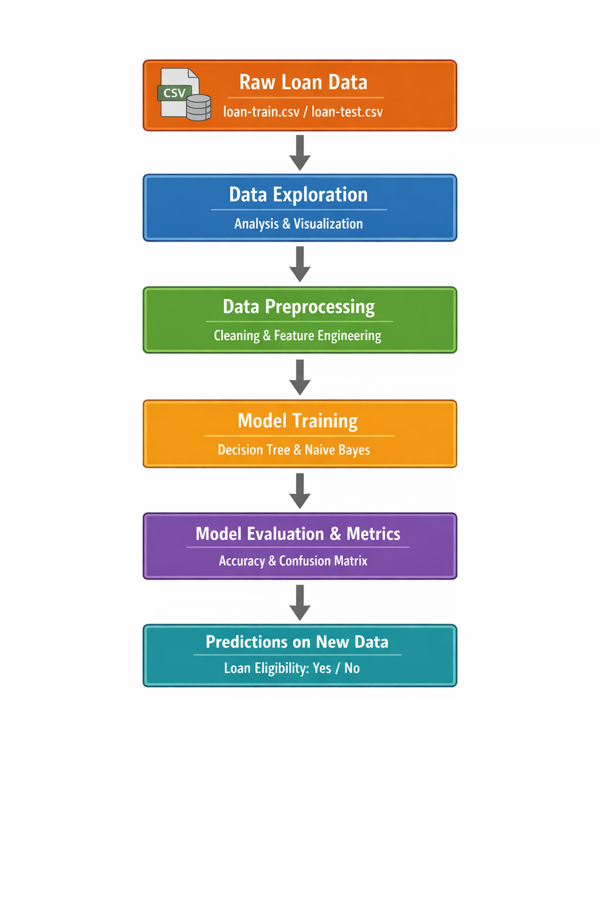
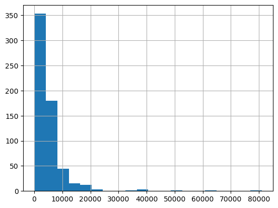
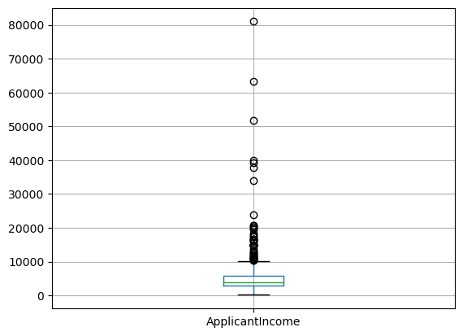

# Loan Eligibility Prediction

[](https://www.python.org/)
[](https://scikit-learn.org/)
[](https://pandas.pydata.org/)
[](https://numpy.org/)

---

## Project Scope
Predict whether applicants are eligible for a loan using historical financial data. This project automates and improves the decision-making process for banks and financial institutions.

## Audience-Friendly Description
This tool helps lenders approve loans faster and more accurately while reducing manual work and minimizing human errors.

## Business Impact
- Speeds up loan approval process  
- Improves operational efficiency  
- Reduces manual errors and ensures consistent decision-making  

---

## Project Description
The project uses **Python and machine learning** to classify loan applications as eligible or not. Key steps include data cleaning, feature engineering, model training, and evaluation.

### Why This Technology
- **Python:** Core programming for data processing and ML  
- **Pandas & NumPy:** Efficient data handling  
- **Scikit-learn:** Training classification models  
- **Matplotlib & Seaborn:** Visualization  

### Model Details
- **Decision Tree:** Accuracy ~72%  
- **Naive Bayes:** Accuracy ~82% (Final Model)  

### Metrics
- **Accuracy:** Correctly classified applications as eligible or not  
- Naive Bayes chosen for superior performance  

### Features
- **Applicant & Co-applicant Income:** Combined as `Total_Income`  
- **Education, Gender, Married:** Encoded numerically  
- **Loan Amount & Term:** Scaled for consistent input  

### Output / Inference
- Predicts loan eligibility (Yes/No) for new applicants  
- Provides actionable insights for banking decisions  

---

## Table of Contents
1. [Folder Structure](#folder-structure)  
2. [Flow Diagram](#flow-diagram)  
3. [Dashboards & Visualizations](#dashboards--visualizations)  
4. [Output](#output)  
5. [How to Run](#how-to-run)  
6. [Dependencies](#dependencies)  
7. [Contribution Guidelines](#contribution-guidelines)  
8. [License & Credits](#license--credits)  
9. [Next Steps](#next-steps)  

---

### Folder Structure

<pre>
📁 Loan-Eligibility-Prediction/
├── 📄 loan-train.csv
├── 📄 loan-test.csv
├── 📄 loan_eligibility_model.ipynb
├── 📁 reports/
│   └── 📁 visualizations/
├── 📄 requirements.txt
└── 📄 README.md
</pre>


### Flow Diagram
  

---

### Dashboards & Visualizations
- **Histograms:** Data distribution for numerical features  
- **Boxplots:** Identify outliers  
- **Feature Importance:** Shows top predictors for loan eligibility
  
- Histogram example :



- Box-plot ecample : 




---

### Output
- Predictions for new applicants (Yes/No)  
- Accuracy metrics and model performance comparison  

---

## How to Run
1. Clone the repository:  
```bash
  git clone https://github.com/mappy92/Loan-Eligibility-Prediction.git
```
2. Navigate to the project folder
```bash
  cd Loan-Eligibility-Prediction
```
3. Install dependencies:
```bash
pip install -r requirements.txt
```
### Dependencies
1. Python >=3.8
2. pandas
3. numpy
4. scikit-learn
5. matplotlib
6. seaborn
(Use pip freeze > requirements.txt to capture dependencies.)

### Contribution Guidelines
1. Fork the repository
2. Create a branch for new feature/fix
3. Submit a pull request with description

### License & Credits
1. License: MIT License
2. Credits: Python, Scikit-learn, Pandas, NumPy, Seaborn libraries

## Next Steps
 1. Explore advanced models like Random Forest or XGBoost
 2. Hyperparameter tuning for improved accuracy
 3. Deploy as a web application for real-time loan eligibility prediction
